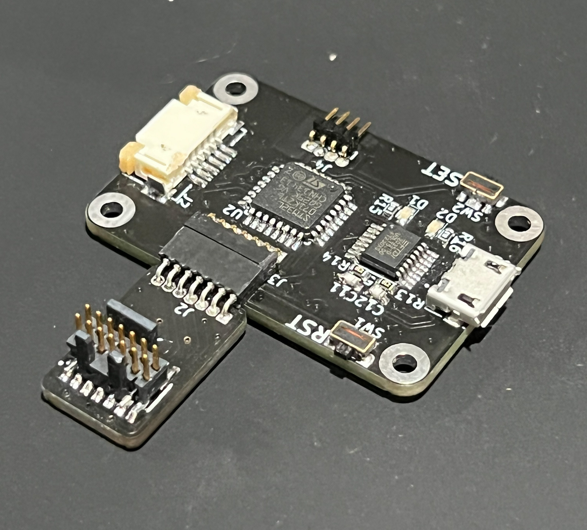

# DigitalFadingLED
Microcontroller project which uses a usb virtual serial port to control the color of a RGB led, brightness and fade rate.

## Serial Commands

The FadingLED device waits for specific serial commands. The following table lists the specifc commands:

|Serial Command|Command Message|
| :---- | :---- |
| [Get Colors](#get-colors) | `"COLOR?\r\n"` |
| [Set Colors](#set-colors) | `"COLOR <Red>,<Green>,<Blue>\r\n"` |
| [Get Luminance](#get-luminance) | `"LUM?\r\n"` |
| [Set Luminance](#set-luminance) | `"LUM <Luminance>\r\n"` |
| [Get Rate](#get-rate) | `"RATE?\r\n"` |
| [Set Rate](#set-rate) | `"RATE <Rate>\r\n"` |
| [Get Save Data](#get-save-data) | `"SAVE?\r\n"` |
| [Set Save Date](#set-save-data) | `"SAVE\r\n"` |
| [Get ID](#get-id) | `"ID?\r\n"` |
| [Set ID](#set-id) | `"ID <ID number>\r\n"` |

### **Get Colors**

Returns current color settings as unsigned integer values from 0 to 255

*Serial Command:* `"COLOR?\r\n"`

*Return String:* `"Red <0 to 255>; Green <0 to 255>; Blue <0 to 255>;\n\r"`

---

### **Set Colors**

Sets the current color setting using provided unsigned interger values for 0 to 255

*Serial Command:* `"COLOR <Red>,<Green>,<Blue>\n\r"`

---

### **Get Luminance**

Returns the current brightness/luminance setting as an unsigned integer from 0 to 1000

*Serial Command:* `"LUM?\n\r"`

*Return String:* `<Luminance Value>\n\r`

---

### **Set Luminance**

Sets the current brightness/luminance setting using a provided unsigned interger from 0 to 1000, 0 to 100.0 percent.

*Serial Command:* `"LUM <Luminance>\r\n"`

---

### **Get Rate**

Returns the current rate setting as an unsigned integer from 0 to 255.

*Serial Command:* `"RATE?\n\r"`

*Return String:* `<Rate Value>\n\r`

---

### **Set Rate**

Sets the current brightness/luminance setting using a provided unsigned interger from 0 to 1000, 0 to 100.0 percent.

*Serial Command:* `"LUM <Luminance>\r\n"`

---

### **Get Save Data**

Returns the current settings saved in the on board EEPROM.

*Serial Command:* `"SAVE?\r\n"`

*Return String:* `"ID: <ID Setting>\nRED: <Red Value>\nGREEN: <Green Value>\nBLUE: <Blue Value>\nLUM: <Luminance Value>\nRATE: <Rate Value>\n\r"`

---

### **Set Save Data**

Saves the current settings in the on board EEPROM. The settings saved include:

* ID Value
* Red Value
* Green Value
* Blue Value
* Luminance Value
* Rate Value

*Serial Command:* `"SAVE\r\n"`

---

### **Get ID**

Returns the current ID number setting saved in the EEPROM.

*Serial Command:* `"ID?\n\r"`

*Return String:* `<ID Number>\n\r`

---

### **Set ID**

Sets the provided unsigned integer from 0 to 255 as an ID number to be saved in the EEPROM. 

*Serial Command:* `"ID <ID Number>\n\r"`
